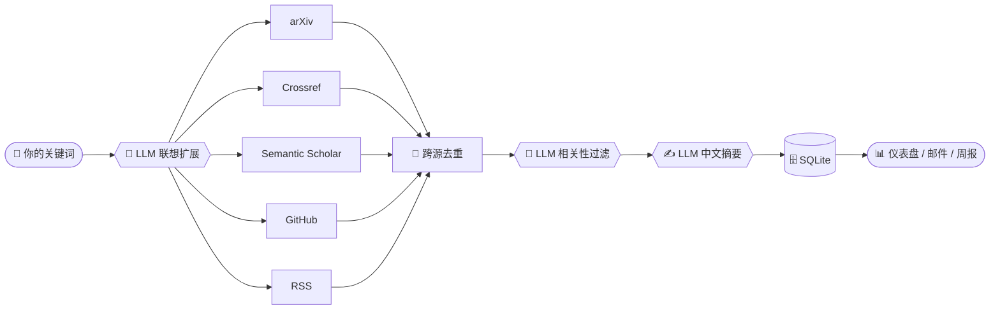

<div align="center">

# 📚🔭 auto-paper-collecter

### *你的私人学术雷达 · Your Personal Research Radar*

每天清晨，让 AI 替你逛遍 arXiv、把最新最相关的论文端到你面前 ☕✨

<br>


<br>
<sub>如果它帮你省下了刷 arXiv 的时间，欢迎点一个 ⭐ —— 这是对作者最大的鼓励！</sub>

</div>

---

## 🌟 这是什么 · What is this

**auto-paper-collecter** 是一个轻量、自托管的**学术文献自动聚合工具**。

你只要告诉它你关心的几个关键词，它就会每天自动：

> 🛰️ 跨 **arXiv / Crossref(含 IEEE·ACM)/ Semantic Scholar / GitHub / RSS** 多源检索
> 🧠 用 **LLM 做"联想式"扩展检索**，不再只匹配字面关键词
> 🎯 用 **LLM 把跨领域、不相关的论文过滤掉**，只留计算机领域、真正切题的
> ✍️ 为每篇生成**中文摘要**(一句话 TL;DR / 方法 / 核心贡献)
> 📊 分析**领域热点**、生成**每周报告**，还能**邮件 / 浏览器推送**

一个零构建的单页仪表盘，前后端同源，开箱即用。

---

## 🎯 为什么做它 · Motivation

> [!NOTE]
> 做科研最累的事情之一，是**跟踪文献**。
> arXiv 每天上新成百上千篇，关键词搜索要么漏掉同义写法、要么被一堆跨领域结果淹没，
> 手动刷既费时又容易错过。

于是有了这个小工具 —— 把"**每天读一遍最新文献**"这件事**自动化**，并交给 LLM 做最脏最累的两件事：

1. **想得更全**：`C2Rust` 也该搜到 `C-to-Rust translation`、`migrating legacy C to Rust`……
2. **筛得更准**：把"医学里的 *translation*""金融里的 *AI*"这种同名跨领域噪声挡在门外。

让你打开页面，看到的就是**一份干净、按时间排好、带摘要的当日文献流**。🫧

---

## ✨ 功能特性 · Features

| | 功能 | 说明 |
|:--:|---|---|
| 📰 | **今日文献流** | 多源聚合 + 按真实发表时间排序；无新文时智能回填；顶栏实时搜索 |
| 🧠 | **LLM 智能抓取** | 关键词联想扩展 + 计算机领域相关性过滤，召回更广、噪声更少 |
| 🔥 | **领域热点** | LLM 聚合成主流子领域，统计近 7/30 天增量，Top 3 给出**详细方向总结**与对应论文 |
| ⭐ | **收藏与笔记** | 一键收藏、写笔记、复制 **BibTeX** |
| 🗞️ | **每周报告** | 每周精选 + 分方向小结，自动归档 |
| 🔔 | **推送通知** | 浏览器通知 + 可选 **SMTP 邮件摘要**（定时发送） |
| 🛰️ | **GitHub 实时源** | 顺带追踪与主题相关的最新代码仓库 / 论文实现 |
| 🌏 | **本地化** | 界面与摘要中文友好，时区可配 |

---

## 🧩 工作原理 · How it works



<div align="center"><sub>纯 Python 跑确定性流程，把"判断"交给 LLM —— 既快又准。</sub></div>

---

## 🚀 快速开始 · Quick Start

```bash
# 1) 克隆并进入
git clone https://github.com/PenghaoJiang/auto-paper-collecter.git
cd auto-paper-collecter

# 2) 建虚拟环境 & 装依赖
python -m venv .venv
source .venv/bin/activate            # Windows: .venv\Scripts\activate
pip install -r requirements.txt

# 3) 配置（复制模板后编辑 .env，填入你的 AI 网关等）
cp .env.example .env

# 4) 起飞 🛫
python run.py
```

打开 **http://localhost:8000** → 进入「订阅设置」填关键词 → 点「保存并拓取」即可。

> [!TIP]
> 关键词建议用**英文**（各源召回率更高）；界面与摘要是中文。首次抓取 + 摘要约需 1–3 分钟，后台进行，完成后页面自动出结果。

---

## ⚙️ 配置 · Configuration

所有配置都在 `.env`（参见 `.env.example`）：

| 变量 | 必填 | 说明 |
|---|:--:|---|
| `AI_BASE_URL` / `AI_API_KEY` / `AI_MODEL` | ✅ | 任意 **OpenAI 兼容**网关。`AI_ENABLED=false` 时退回原始摘要、不调 LLM |
| `SEMANTIC_SCHOLAR_KEY` | ⬜ | 可选，不填也能用，仅限速更严 |
| `GITHUB_TOKEN` | ⬜ | 可选，提高 GitHub 检索速率上限 |
| `SMTP_*` / `EMAIL_*` | ⬜ | 可选，填入后定时任务发送当日摘要邮件（Gmail 需**应用专用密码**） |
| `REFRESH_TIMES` / `TIMEZONE` | ⬜ | 每日定时刷新时间与时区（默认 `10:00,22:00` / `Asia/Shanghai`） |
| `BACKFILL_N` / `RSS_FEEDS` | ⬜ | 回填篇数 / 学术新闻 RSS 源 |

> [!IMPORTANT]
> `.env` 已被 `.gitignore` 忽略，**密钥永远不会被提交**。请妥善保管自己的 key 🔐

---

## 🛰️ 数据源 · Data Sources

| 来源 | 内容 | 备注 |
|---|---|---|
| **arXiv** | 预印本（官方 API） | 计算机领域主力 |
| **Crossref** | 期刊/会议元数据 | 含 IEEE·ACM，仅元数据 + 摘要 |
| **Semantic Scholar** | 综合学术检索 | 自带 TLDR；限定计算机领域 |
| **GitHub** | 实时仓库 / 论文代码 | 作为补充信号 |
| **RSS** | 学术新闻 / 博客 | 可自定义订阅源 |

---

## 📡 API

<details>
<summary>展开查看全部接口</summary>

| 方法 | 路径 | 说明 |
|---|---|---|
| `GET`  | `/api/bootstrap` | 仪表盘一次性取数（feed / 库 / 热点 / 周报 / 设置） |
| `POST` | `/api/refresh` | 后台触发一次抓取（立即返回，前端轮询 `refreshing`） |
| `GET`  | `/api/trends?domain=&window=7` | 领域热点（Top3 + 各方向增量 + 论文） |
| `GET`  | `/api/report/weekly` | 生成 / 取最新周报 |
| `POST` | `/api/library/{paper_id}` | `{saved, read, note}` 收藏 / 已读 / 笔记 |
| `GET·PUT` | `/api/settings` | 关键词 / 来源 / 时间 / 回填 N / 推送 / 邮箱 |
| `POST` | `/api/test-email` | 发送一封测试邮件验证 SMTP |

</details>

---

## 🗺️ 路线图 · Roadmap

- [x] 多源聚合 + LLM 联想扩展 + 相关性过滤
- [x] 领域热点（细分方向 + 详细总结 + 论文清单）
- [x] 收藏 / 笔记 / BibTeX / 每周报告
- [x] 浏览器 + 邮件推送、定时任务
- [ ] 更多数据源（OpenReview / bioRxiv …）
- [ ] 多用户 + 鉴权（PostgreSQL）
- [ ] 一键 Docker 部署
- [ ] 移动端适配

> 欢迎在 [Issues](../../issues) 里提你想要的功能！🙌

---

## 🤝 参与贡献 · Contributing

这是一个**业余时间打磨的小项目**，非常欢迎任何形式的参与：

- 🐛 发现 Bug → 提个 [Issue](../../issues)
- 💡 有好点子 → 在 [Discussions / Issues](../../issues) 聊聊
- 🔧 想动手 → Fork → 改 → 提 **Pull Request**

无论是改一个错别字还是加一个数据源，都同样珍贵 💗

---

<div align="center">

### ⭐ 如果觉得有用，点个 Star 支持一下吧！

<sub>你的每一个 Star，都是作者继续维护的动力 🌱</sub>

<br><br>

**📚 Read less, know more. Let the radar do the scanning.** 🔭

<br>

<sub>Made with ❤️ & ☕ · Licensed under <a href="./LICENSE">MIT</a></sub>

</div>
